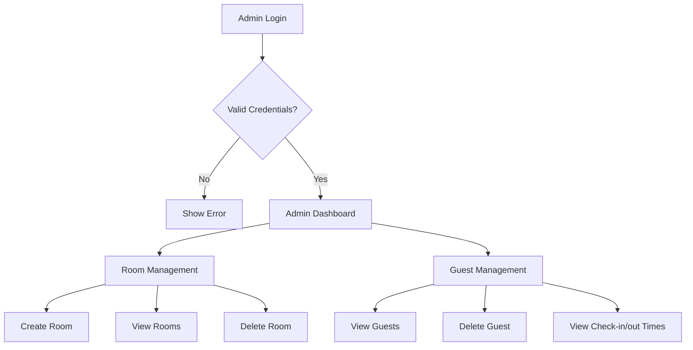
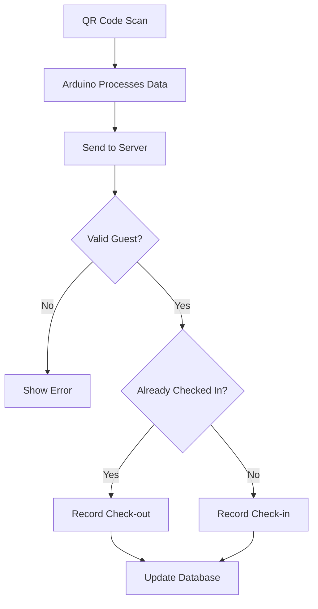
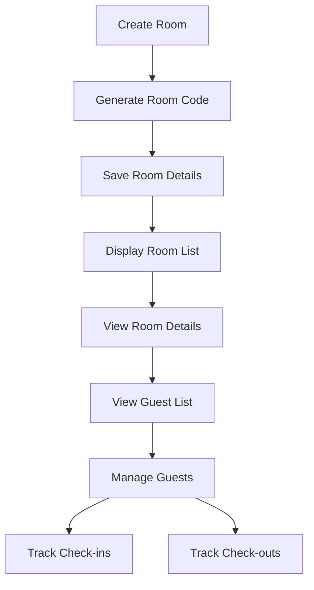
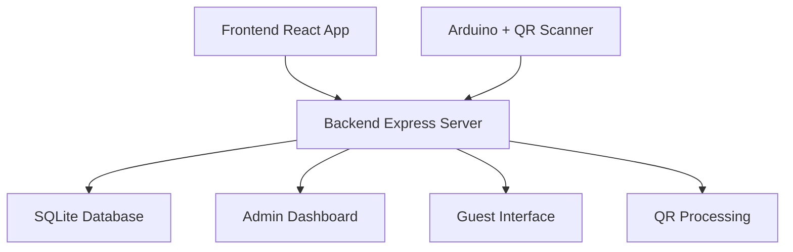
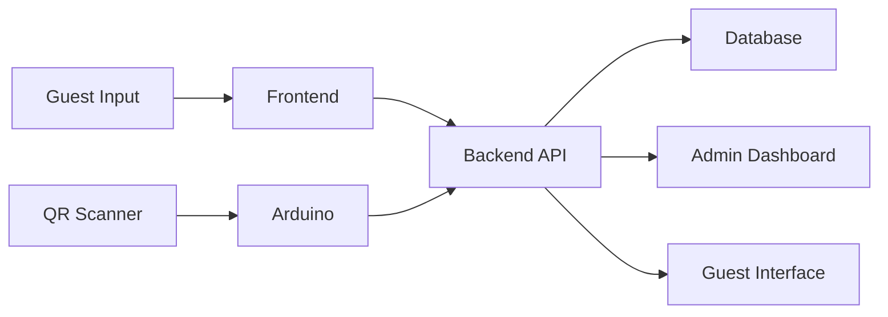

# System Flowchart

## Guest Registration and Check-in Flow

```mermaid
Start([Start]) --> A[Guest Enters Room Code]
    A --> B{Valid Room Code?}
    B -->|No| C[Show Error Message] --> End1([End])
    B -->|Yes| D[Display Room Details]
    D --> E[Guest Registration Form]
    E --> F[Generate QR Code]
    F --> G[Download QR Code]
    G --> H[Guest Uses QR Code]
    H --> I[QR Scanner Reads Code]
    I --> J[System Records Check-in] --> End2([End])
```

## Admin Management Flow



## QR Code Scanning Flow



## Room Management Flow



## System Architecture



## Data Flow


